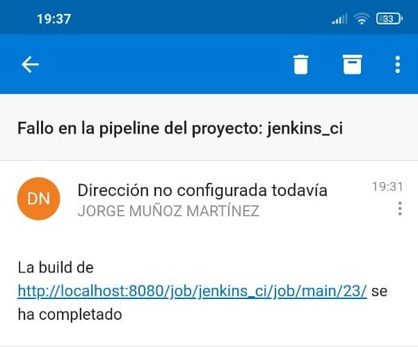

# Docker + Continuous Integration

Enlace GitHub: https://github.com/jorgeMunozMartinez/jenkins_ci

## Índice

- [Decisiones tomadas](#decisiones_tomadas)
- [Arquitectura TI](#arquitectura_ti)
- [Funcionamiento](#funcionamiento)


## Decisiones tomadas

El proyecto se ha realizado en una instalación de Ubuntu.

En la máquina se tiene instalado Docker, y se genera en Docker una imagen de Jenkins con la que trabajar.


### Arquitectura

Elementos de la arquitectura:
- **Jenkins**
- **GitHub**
- **Docker**
- **Ngrok**

### Configuración de los elementos de la arquitectura

#### Jenkins

##### Plugins y Jobs necesarios

Para ese proyecto se va a crear una **Multibranch Pipeline**, ya que escanea todas las ramas del repositorio en busca en un archivo llamado **Jenkinsfile**. Este archivo contiene la fases que serán ejecutadas para generar un artefacto final.

Antes de crear la **Multibranch Pipeline** es necesario instalar unos plugins:
- CloudBees Docker Build and Publish plugin
- Docker Pipeline
- Docker Plugin
- Multibranch Scan Webhook Trigger

De los plugins instalados. Los tres primeros son necesarios para la creación y posterior publicamiento de las imágenes Docker. El último plugin se usa para modificar la configuración del Webhook de Jenkins.

##### Creación del Job

En la creación de Job los parámetros importantes son:
- **Branch Sources**
- **Build Configuration**
- **Scan Mutibranch Pipeline Triggers**


###### Branch Sources
- En el apartado **Project Repository** se le debe indicar la url del repositorio Git que va a descargar y compilar, junto con las credenciales necesarias para acceder a el.
- En el apartado **Behaviours** se le indica que ramas del repositorio deben ser escaneadas, por defecto escanea todas las ramas.

###### Build Configuration
- En el apartado **mode** se debe indicar la ruta y el nombre del fichero que tiene los pasos de ejecución de Jenkins.

###### Scan Multibranch Pipeline Triggers
- Se selecciona **Scan by webhook** indicado el nombre del **Trigger token** para configurar la URL del webhook de Git

#### Ngrok

Tras descargar y configurar Ngrok, se debe escribir:
```bash
./ngrok http 8080
```


Ahora la ruta **http://localhost:8080** pasa a ser **http://293ce6b50e0f.ngrok.io**. Cuando apaga el ordenador se tiene que ejecutar de nuevo **ngrok**.

#### GitHub

Tras la creación de un proyecto se debe seleccionar la opción **Settings** y **Wenhooks**


- En la opción **Payload URL** se debe poner la URL del job de Jenkis que se ejecutará cuando se realice un cambio en el repositorio. Como se está usando el **Scan Multibranch Pipeline Triggers** la url del job cambia:
```html
<url_job>multibranch-webhook-trigger/invoke?token=<nombre_del_token>
```
En este caso la url se quedaría como:
```
http://293ce6b50e0f.ngrok.io/multibranch-webhook-trigger/invoke?token=jenkins_ci
```
- En **Content type** se selecciona **application/json**
- Por último se debe seleccionar que suceso triggerea el webhook, para este caso se pone **Just the push event**

Cuando se inicia la máquina se debe cambiar la webhook con la nueva URL de ngrok.

Para enviar un correo electrónico usando los métodos **Post** de jenkisn se debe configurar el apartado **Extended E-mail Notification** de la configuración, e incluir:
- SMTP Server
- SMTP Port
- SMTP Username
- SMTP Password


Para este caso se usa un correo electrónico creado para otra asignatura ya configurado para permitir el acceso a aplicaciones menos seguras.

Tanto si la build falla o se completa correctamente llegará un mensaje al correo definido en el pipeline indicando el resultado.



## Arquitectura TI

La idea es que cuando una persona realice un push de código a GitHub, se debe triggerear un Job en Jenkins que ejecute una serie de pasos donde se cree una imagen Docker. En esa imagen se ejecuta un script python, posteriormente se debe publicar la imagen Docker.


## Funcionamiento

- Cuando se realiza un push en el repositorio de Git se triggerea el Job de Jenkins.

- Cuando se activa el Job se recorren todos los repositorio en busca del Jenkinsfile.

- Posteriormente se se descarga el repositorio Git en el Workspace de Jenkins y comienza la ejecución siguiendo los pasos definidos en el Jenkisnfile
```python
def gitRepoName
pipeline {
    agent any
    stages {
      stage("init"){
        steps {
          script{
            gitRepoName = scm.getUserRemoteConfigs()[0].getUrl().tokenize('/').last().split("\\.")[0]
          }
        }
      }
      stage("test"){
        steps {
          script{
            sh "pytest pruebas.py"
          }
        }
      }
      stage("build") {
        steps {
          sh "echo 2845 | sudo -S docker build -t python_script . "
        }
      }
      stage("run") {
        steps {
          sh "echo 2845 | sudo -S docker build -t python_script . "
        }
      }
    }
    post{
      success{
        emailext (
            subject: "Fallo en la pipeline del proyecto: ${gitRepoName}",
              body: "La build de ${env.BUILD_URL} se ha completado",
              to: "Jorge.Munoz9@alu.uclm.es"
         )
      }
      failure{
          emailext (
            subject: "Fallo en la pipeline del proyecto: ${gitRepoName}",
              body: "La build de ${env.BUILD_URL} ha fallado",
              to: "Jorge.Munoz9@alu.uclm.es"
         )
      }
    }
}
```
En este caso se realizan pruebas definidas en el archivo **pruebas.py** sobre el archivo **script.py**. Si las pruebas son satisfactorias se crear y se publica la imagen Docker del archivo pruebas.py. Fué necesario asignar permisos de súper usuario al **usuario jenkins** y se le asignó la **contraseña 2845**.

- Para realizar las pruebas pertinentes se ha creado el archivo **pruebas.py**
```python
#!/usr/bin/env python3
import script
class Tests:
    def test_connection(self):
        assert 'uclm' == script.check('http://www.uclm.es')
```

- Para crear la imagen Docker se necesita de un archivo llamado **Dockerfile**
```
FROM python:3.7-alpine
RUN pip install requests
COPY script.py /
CMD [ "python", "script.py"]
```
En esta caso se va a ejecutar el archivo **script.py**, para ello se usa **python:3.7-alpine**, se instalan los paquetes necesarios, se copia el archivo script.py en la ruta de trabajo de Jenkins, por último se ejecuta con python el archivo script.py
- El archivo **script.py** es un script simple de python. Donde se comprueba si existe conexión con la UCLM
```python
#!/usr/bin/env python3
import requests
def check(url):
   x = requests.get(url)
   if x.status_code == 200:
     print('uclm')
     return 'uclm'
   else:
     print('no uclm')
     return 'no uclm'
```
- Tras la ejecución de del Jenkins pipeline se debe de haber creado y publicado una imagen Docker. Mediante el comando **sudo docker images --all** se puede ver las imágenes de Docker

```shell
jorge@jorge-GE62-7RE:~/Escritorio$ sudo docker images --all
REPOSITORY          TAG            IMAGE ID       CREATED              SIZE
<none>              <none>         994e8c8d4919   About a minute ago   51.4MB
python_script       latest         1fe989297e94   About a minute ago   51.4MB
<none>              <none>         e9102a6bddb1   About an hour ago    51.4MB
hello_there         latest         7c0346ae9469   About an hour ago    51.4MB
<none>              <none>         03026fd1271a   About an hour ago    51.4MB
python              3.7-alpine     aeae281012cb   3 days ago           41.8MB
jenkins/jenkins     latest         3d2f88dfa0ea   10 days ago          572MB
eclipse-mosquitto   latest         7e47c4a28948   2 weeks ago          9.83MB
telegraf            latest         750c89a1a193   2 weeks ago          298MB
influxdb            latest         129820bf5dd7   2 weeks ago          283MB
grafana/grafana     6.5.0-ubuntu   3ddf0dcfbf35   17 months ago        263MB
```
En este caso se puede ver una imagen llamada **python_script**, que es la creada tras la ejecución del Jenkinsfile.
